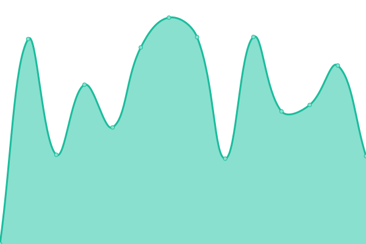

# [📈 Live Status](https://status.blueskyclouds.com): <!--live status--> **🟧 Partial outage**

This repository contains the open-source uptime monitor and status page for [BlueSkyClouds](https://blueskyclouds.com), powered by [Upptime](https://github.com/upptime/upptime).

With [Upptime](https://upptime.js.org), you can get your own unlimited and free uptime monitor and status page, powered entirely by a GitHub repository. We use [Issues](https://github.com/BlueSkyClouds/StatusSite/issues) as incident reports, [Actions](https://github.com/BlueSkyClouds/StatusSite/actions) as uptime monitors, and [Pages](https://status.blueskyclouds.com) for the status page.

<!--start: status pages-->
<!-- This summary is generated by Upptime (https://github.com/upptime/upptime) -->
<!-- Do not edit this manually, your changes will be overwritten -->
<!-- prettier-ignore -->
| URL | Status | History | Response Time | Uptime |
| --- | ------ | ------- | ------------- | ------ |
|  [BlueSkyClouds](https://blueskyclouds.com) | 🟩 正常 | [blue-sky-clouds.yml](https://github.com/BlueSkyClouds/StatusSite/commits/HEAD/history/blue-sky-clouds.yml) | 

 1691ms
     
 | 

<a href="https://status.blueskyclouds.com/history/blue-sky-clouds">100.00%</a>
    

|  [Blog](https://blog.blueskyclouds.com) | 🟥 Down | [blog.yml](https://github.com/BlueSkyClouds/StatusSite/commits/HEAD/history/blog.yml) | 

 1599ms
     
 | 

<a href="https://status.blueskyclouds.com/history/blog">100.00%</a>
    

|  [LemonHD](https://lemonhd.org) | 🟥 Down | [lemon-hd.yml](https://github.com/BlueSkyClouds/StatusSite/commits/HEAD/history/lemon-hd.yml) | 

 0ms
     
 | 

<a href="https://status.blueskyclouds.com/history/lemon-hd">100.00%</a>
    

|  [93x](https://bbs.upkk.com) | 🟥 Down | [93x.yml](https://github.com/BlueSkyClouds/StatusSite/commits/HEAD/history/93x.yml) | 

 1782ms
     
 | 

<a href="https://status.blueskyclouds.com/history/93x">100.00%</a>
    

|  [Zombieden](https://zombieden.cn/#ServerList-Title) | 🟩 正常 | [zombieden.yml](https://github.com/BlueSkyClouds/StatusSite/commits/HEAD/history/zombieden.yml) | 

 1850ms
     
 | 

<a href="https://status.blueskyclouds.com/history/zombieden">100.00%</a>
    

<!--end: status pages-->

[**Visit our status website →**](https://status.blueskyclouds.com)

## 📄 License

- Powered by: [Upptime](https://github.com/upptime/upptime)
- Code: [MIT](./LICENSE) © [BlueSkyClouds](https://blueskyclouds.com)
- Data in the `./history` directory: [Open Database License](https://opendatacommons.org/licenses/odbl/1-0/)
